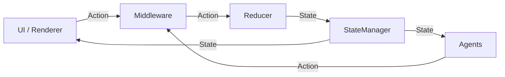

# Sonic

## Overview

Sonic is a Kotlin-first state management toolkit that keeps UI code predictable across Android Views, Jetpack Compose,
Desktop Compose, and CLI targets. The framework favors composition (`bindState`) over inheritance, exposes lifecycle
control to the application, and supplies lightweight helpers (result model, selectors, state agents) that eliminate
repetitive glue without introducing hidden magic. Every document in this repository follows the same structure so teams
can quickly scan intent, prerequisites, workflow, and next steps.

## Key Points

- Multi-platform core: one `IStateManager` implementation powers Android, Desktop, and CLI experiences.
- Lifecycle-safe bindings: `bindState` connects managers to renderers using any coroutine scope you own.
- Built-in helpers: Status, selectors, and agents solve recurring “status + cleanup” problems.
- Sample app parity: `app/` demonstrates both XML navigation flows and the Compose showcase that mirrors the docs.

## Prerequisites

- Kotlin 1.9+, Gradle 8+, and kotlinx.coroutines 1.8+.
- Android Studio or IntelliJ IDEA for running the samples.
- Working knowledge of unidirectional data flow (state → UI → action).

## Workflow

1. **Install the library**
   ```kotlin
   // From Maven Central (preferred)
   implementation(platform("dev.amaro.sonic:bom:0.6.0"))
   implementation("dev.amaro.sonic:core")
   implementation("dev.amaro.sonic:binding")
   implementation("dev.amaro.sonic:result")
   implementation("dev.amaro.sonic:compose")

   // From a multi-module workspace
   implementation(project(":sonic-core"))
   implementation(project(":sonic-binding"))
   implementation(project(":sonic-result"))
   implementation(project(":sonic-compose"))
   ```
2. **Model your feature**
   ```kotlin
   data class HomeState(val title: String = "", val items: List<Item> = emptyList())

   sealed class Action : IAction {
       object Load : Action()
       data class Select(val id: String) : Action()
   }

   class HomeManager(scope: CoroutineScope) : StateManager<HomeState>(HomeState(), scope) {
       override val reducer = IReducer<HomeState> { action, current ->
           when (action) {
               Action.Load -> current.copy(title = "Loading…")
               is Action.Select -> current.copy(title = "Selected ${action.id}")
               else -> current
           }
       }
   }
   ```
3. **Bind UI to state**
   ```kotlin
   class HomeFragment : Fragment(), IRenderer<HomeState> {
       private val manager by inject<HomeManager>()

       override fun onViewCreated(view: View, savedInstanceState: Bundle?) {
           bindState(manager, this, viewLifecycleOwner.lifecycleScope)
           manager.perform(Action.Load)
       }

       override fun render(state: HomeState, performer: IPerformer<HomeState>) {
           titleView.text = state.title
           recycler.adapter.submitList(state.items)
       }
   }
   ```
4. **Layer in advanced helpers**
    - Adopt Status for running/success/failure tracking (`docs/features/RESULT_HANDLING.md`).
    - Use `selectDistinct` with `LocalStateManager` for Compose selectors (`docs/features/SELECTORS.md`).
   - Attach `StatusClearingAgent`, logging agents, or custom middleware as needed (
      `docs/features/MIDDLEWARE_AGENTS.md`).

## Data Flow



## Next Steps

- Read `docs/GETTING_STARTED.md` for a guided installation and verification walkthrough.
- Study the concepts catalog in `docs/CONCEPTS.md`, then deep dive into the feature-specific guides under
  `docs/features/`.
- Explore the sample apps via `docs/SAMPLE_WALKTHROUGH.md` and keep `docs/API_REFERENCE.md` handy for class lookups.
