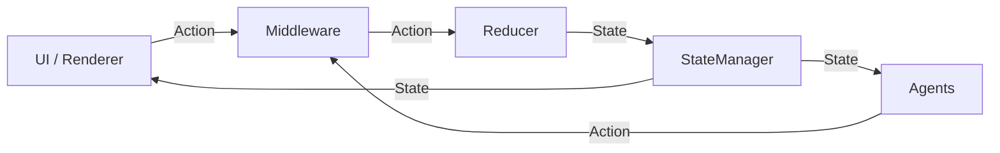

# Sonic Concepts

## Overview

This document explains the core abstractions that form Sonic’s unidirectional data flow so every team member shares the
same mental model before touching feature-specific guides.

## Key Points

- Sonic follows a predictable loop: `Action → Middleware → Reducer → State → Agents → Renderer → Action`.
- Interfaces live under `library/src/main/java/dev/amaro/sonic` and are platform-agnostic.
- You can adopt subsets (e.g., state manager + renderer only) or the whole pipeline depending on your needs.

## Prerequisites

- Read `README.md` for the project overview.
- Optional: complete `docs/GETTING_STARTED.md` to see the concepts in practice.

## Concepts

1. **IAction**
    - Marker interface for immutable intents or side effects.
    - Declare sealed classes per feature to keep the action set explicit.

2. **IReducer**
    - Pure function interface `(action, currentState) -> newState`.
    - Must be deterministic and side-effect free; persistence/network work belongs in middleware.

3. **IStateManager / StateManager**
    - Hosts current state (`StateFlow`) and orchestrates middlewares + reducer execution.
    - Accepts a `CoroutineScope` so callers own lifecycle management.
    - Exposes `listen()` for observers and `perform(action)` for dispatching.

4. **IMiddleware**
    - Intercepts actions before reducers run; perfect for validation, async calls, logging.
    - Built-in helpers: `DirectMiddleware`, `ConditionedDirectMiddleware`.

5. **IRenderer + IPerformer**
    - Renderer: UI component that receives every state emission plus a performer to dispatch new actions.
    - Performer: thin wrapper around the manager’s `perform()` to keep UI code decoupled.

6. **IProcessor**
    - Internal interface used by `StateManager` to pass actions between middleware and reducer.
    - Rarely implemented directly; understanding it helps when building custom managers.

7. **bindState / StateBinding**
    - Utility to connect a manager to a renderer within any coroutine scope.
    - `StateBinding` wraps a state snapshot + performer for Compose previews or DI.

8. **State Agents (IStateAgent)**
    - Observe emitted state (post-reducer) and can schedule new actions via `stateManager.scopedPerform`.
    - Always return the original state; used for cross-cutting behavior like `ResultClearingAgent`.

9. **Selectors**
    - `selectDistinct` extension on `StateFlow`/`Flow` to subscribe to derived values (commonly used in Compose).

10. **Result Suite**
    - `ResultInfo`, `ResultBuilder`, `ResultClearingAgent`, and `IStatusContainer` provide a consistent pattern for
      success/error handling.

## Data Flow

## Next Steps

- Dive into the topic-specific guides in `docs/features/` to learn how to apply each concept.
- Use `docs/API_REFERENCE.md` to quickly locate classes in the codebase.
- Reference `docs/SAMPLE_WALKTHROUGH.md` to map concepts to working apps.
